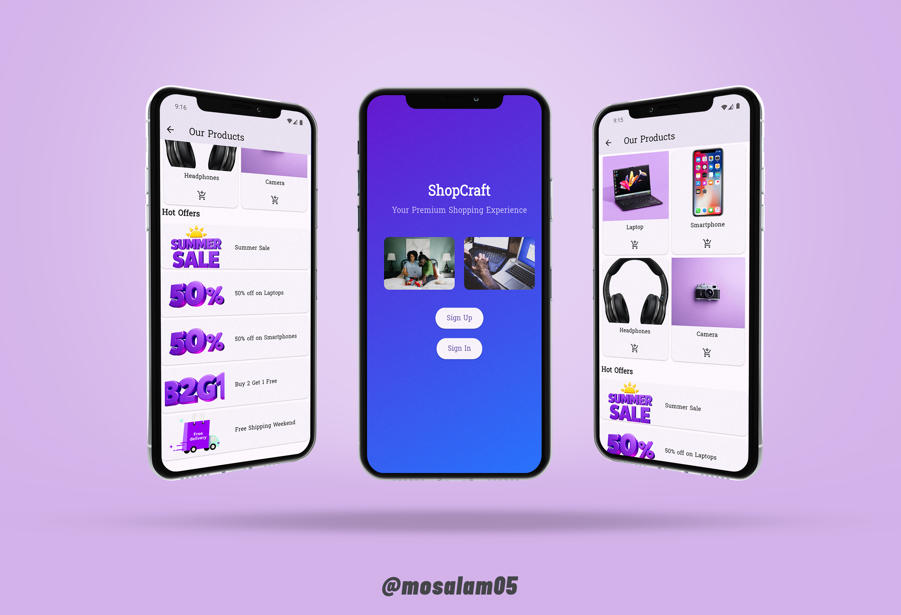

# 🛒 ShopCraft App

A **Flutter shopping application** that simulates a real-world e-commerce experience.  
It includes **authentication**, **product browsing**, **cart interaction**, and **localization** 🌍.  

**This project was developed as part of [Sprints x Microsoft Summer Camp](https://sprints.ai/en-eg/Sprints-x-Microsoft-Summer-Camp)**.  


## ✨ Features

### 🎉 Welcome Screen
- Beautiful **gradient background** 🌈
- **Custom font**: `Suwannaphum`
- **Two images** side-by-side (local + network)
- Two main buttons:
  - **Sign Up**
  - **Sign In**

### 🔑 Authentication
#### 📝 Sign Up
- Validations:
  - Full name (first letter uppercase) ✏️
  - Email must contain `@`
  - Password: minimum 6 characters 🔒
  - Confirm password matches 🪞
- Success dialog on valid submission ✅
- **Smooth fade transition** ➡️ to Home Screen

#### 🔓 Sign In
- Validations:
  - Email format
  - Password length
- Success dialog on valid submission ✅
- **Smooth fade transition** ➡️ to Home Screen

### 🏠 Home Screen
- **AppBar** with **localized title** (changes with device language)
- **PageView** of featured products 📸
- **GridView** of products:
  - Product image
  - Title
  - Add-to-cart icon → shows SnackBar
- **Hot Offers** section:
  - Built using `ListView.builder`
  - Product image + description

### 🌍 Localization
- Supports **English** 🇺🇸 and **Arabic** 🇪🇬
- **Automatically matches device language**
- Uses `.arb` files & `intl` package

### 🎨 UI Inspiration
Inspired by: [Aesthetic Flow Shop Intro](https://aesthetic-flow-shop-intro.lovable.app/)


## 🛠️ Technologies Used
- **Flutter** (UI framework)
- **Dart** (Logic & OOP)
- **intl** (Localization)
- **Material Design** components


## 📸 Screenshots



## 💻 Setup instructions

### 1️⃣ Clone the repo
```bash
git clone https://github.com/mosalam05/shopcraft_app.git
```

### 2️⃣ Install dependencies
```bash
flutter pub get
```

### 3️⃣ Run the app
```bash
flutter run
```


<div align="center">

## 👨‍💻 Developed By
 [**Mostafa Mahmoud Mohamed Ahmed**](https://www.linkedin.com/in/mosalam05/)  

  </div>
